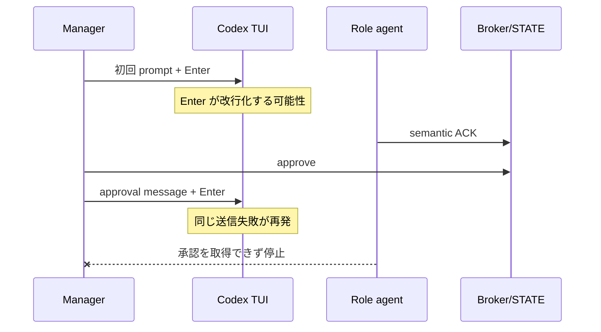

# herdr-dev-loop ACK transport fast fix

Status: design proposal

## 背景

Codex TUI へ prompt を送るとき、text と Enter の間隔が短すぎると、Enter が submit ではなく入力欄の改行として扱われることがある。ACK は、この事故を material work の前に気付きやすくするために導入された。

この目的は正しい。ACK をなくすと、role が prompt を実行していないのに Manager が作業開始済みと思い込む事故が見えにくくなる。

問題は、ACK を承認した後の「進めてよい」という通知にも Codex TUI の `send-text` と Enter を使ったことである。検知対象だった配送経路を、検知後の再開条件にも使ってしまった。

## 問題の循環



初回 prompt の事故を検知できても、承認通知で同じ事故が起きるため、ACK 全体が不安定に見える。

## 設計方針

配送を二つに分ける。

### TUI transport

用途は次に限定する。

- role の最初の prompt を起動する。
- 人が契約を変える補足指示を送る。
- debug 時に明示的な手動 follow-up を送る。

text の可視確認、settle delay、Enter、submit verification は維持する。可視確認できない場合は `unknown` とし、自動再送しない。

### broker/state transport

用途は次とする。

- role からの semantic ACK
- Manager の approve/reject/timeout
- role の承認待ちと承認取得
- ACK application evidence
- restart 後の idempotent recovery

この経路は pane、scrollback、TUI busy state、Enter timing に依存しない。

## 提案する command

role prompt は、ACK report 後に終了せず、次のような一つの command を実行する。

```text
hloop agent ack exchange <role-id> \
  --attempt-id <attempt-id> \
  --task-contract-digest <digest> \
  --ack-file <ack.json> \
  --timeout-seconds 900 \
  --json
```

`exchange` は次を一つの lifecycle として行う。

1. credential を使って exact ACK event を broker へ append する。
2. 同じ event ID の再実行を idempotent に扱う。
3. Manager の semantic decision を read-only polling または broker wake で待つ。
4. approve なら exact run、role、attempt、message、contract digest、ACK event ID を照合する。
5. authenticated application event を broker へ append する。
6. approval payload を stdout へ返し、exit 0 にする。
7. reject、timeout、supersede なら material work を許さない exit code と構造化理由を返す。

既存の `agent report` と `agent ack status --apply` は互換用に残せるが、revision 3 role prompt の標準経路は `exchange` にする。

## Manager resolve

`hloop agent ack resolve` は、semantic decision を broker/STATE へ durable commit した時点で成功する。

- pane notification は既定で `none` とする。
- `--notify-pane` は debug または人が明示した場合だけ使う。
- pane delivery が `unknown` でも decision を rollback しない。
- approve と notification delivery status を同じ field に入れない。
- decision、availability、role application、optional notification を別々に記録する。

推奨 state は次の形である。

```json
{
  "semantic_decision": {
    "status": "approved",
    "ack_event_id": "...",
    "resolved_at": "..."
  },
  "approval_availability": {
    "status": "available",
    "published_at": "..."
  },
  "role_application": {
    "status": "applied",
    "event_id": "...",
    "applied_at": "..."
  },
  "pane_notification": {
    "status": "not-requested"
  }
}
```

## role の material-work gate

role は `exchange` が返した構造化 payload を確認してから作業する。prompt の自然言語だけで approve を推測しない。

必要条件は次である。

- run ID が一致する。
- role ID と active attempt ID が一致する。
- task contract digest が一致する。
- barrier message ID が一致する。
- ACK event ID が Manager decision と一致する。
- decision が `approved` である。
- barrier が superseded されていない。
- Worker revision 3 では completion mode probe が同じ ACK に結び付いている。

一つでも違えば material work を始めない。

## 初回 prompt 送信の検知は残す

broker-native ACK は、最初の TUI prompt が実行されたかを検知する目的を失ってはならない。

初回送信では次を維持する。

1. pane が正しい provider TUI であることを確認する。
2. trust prompt や busy state でないことを確認する。
3. `send-text` 後、入力欄に prompt が見えるまで待つ。
4. configurable settle delay を置く。
5. Enter を1回送る。
6. 入力欄が空になるか、agent が working へ移ることを確認する。
7. 不明なら `unknown` として一度だけ記録し、自動で再 Enter しない。
8. semantic ACK が期限内に来なければ start failure として pane を確認する。

ACK が来たこと自体が、初回 prompt の end-to-end submit が成功した強い証拠になる。

## fast fix の変更範囲

### product code

- `scripts/hloop`
- `scripts/hloop_lib/broker.py`
- `scripts/hloop_lib/events.py`
- 必要なら小さい `scripts/hloop_lib/semantic_ack.py`
- state/event schema
- role prompt renderer
- report protocol と Manager loop の文書

### tests

- ACK exchange unit test
- subprocess blocking/wake integration test
- fake TUI Enter settle regression
- busy pane negative test
- role/attempt/digest mismatch test
- reject、timeout、supersede test
- process crash 後の idempotent resume test
- Manager が pane API を呼ばないことを確認する spy test
- requeue 後の stale decision rejection

## 受入条件

1. 初回 prompt の Enter が改行になった場合、semantic ACK timeout で start failure を検知できる。
2. 正常な role は ACK を broker へ送り、同じ process turn の blocking command で承認を待てる。
3. Manager は busy な Codex pane へ何も送らず approve できる。
4. approve 後、role は pane input なしで material work を開始できる。
5. reject と timeout は role command へ返り、訂正 ACK または停止を要求する。
6. role、attempt、contract、message、ACK event のいずれかが違えば失敗する。
7. crash 後の同じ exchange は event を二重計上しない。
8. pane notification の `unknown` は semantic decision や role application を変更しない。
9. approval application event が Manager に未収穫でも、role が取得した exact approved decision は失われない。
10. audit artifact から decision、availability、application、notification を別々に追跡できる。

## immediate operational fallback

fast fix がまだ統合されていない recovery bootstrap では、TUI の1 Workerだけを使う。現行 `exec` runner は一回の provider process で終わるが、現行 role prompt は ACK 後に停止して Manager notice を待つよう要求するため、seed の安全な fallback にはならない。

bootstrap では次を固定する。

- 初回 prompt の TUI submit を可視確認し、semantic ACK で end-to-end 実行を確かめる。
- 現行 pane approval notice を seed attempt で一度だけ許す。
- delivery が `unknown` または `undelivered` なら再送せず、attempt を停止する。
- task scope は blocking ACK exchange と pane notification 不要化だけにする。
- Manager は broker/STATE の semantic decision を正本とする。
- canary 合格後は bootstrap namespace を捨て、修正済み runtime で fresh namespace を作る。

この一度限りの循環を小さい seed task に閉じ込める。seed に別の fast fix を混ぜないことで、失敗時は product branch を変更せずに停止できる。

## 非目標

- Herdr server 全体の pane transport を作り直さない。
- Codex TUI の Enter 挙動を HLoop 側から保証しない。
- 人が行う任意の途中会話を broker protocol に置き換えない。
- semantic ACK を security sandbox や強い認証境界として扱わない。
- pane delivery の成功を release evidence にしない。

## failure handling

| failure | 状態 | 自動動作 | Manager action |
| --- | --- | --- | --- |
| initial prompt not submitted | ACK timeout | role start を失敗扱いにする | pane を一度確認し、新 attempt を作る |
| approval wait timeout | waiting/timeout | material work を禁止 | decision と Manager lease を確認 |
| wrong attempt | rejected | credential lookup 前に拒否 | stale role を終了 |
| pane notification unknown | advisory failure | 再送しない | 通常は何もしない |
| broker unavailable | spooled/waiting | bounded retry 後に停止 | broker recover |
| decision superseded | superseded | old exchange を失敗させる | fresh contract の ACK を要求 |
| repeated same transport error | circuit-open | new TUI send を止める | [long-running fast fix](2026-07-19-long-running-manager-fast-fix.md) に従う |

## 成功指標

- semantic ACK approve 1件あたりの Manager TUI message 数: 0
- approval notification の `unknown`/`undelivered`: 0
- ACK decision から role application までの p95
- initial prompt から ACK event までの p95
- ACK timeout のうち initial submit failure と role failure の分類率
- 同じ event ID の重複 application 数: 0

時間だけでなく、Manager の注意を何回割り込んだかを測る。
