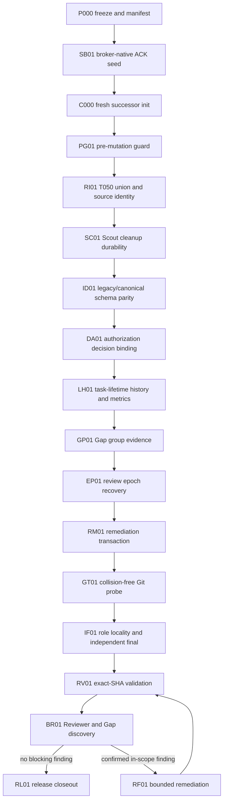

# herdr-dev-loop 0.5.3 recovery task graph

Status: approved execution plan for recovery bootstrap

## 目的

この文書は、0.5.3 の復旧で Manager が作る task の境界と順序を固定する。旧 run の task 数を減らすことや既存 finding を0件にすることは目的に含めない。対象は、元計画の未達、R005、G053、T050 R002、T051 R003、ACK transport と長時間運転の fast fix に限る。

task は開始前なら分割できる。開始後は contract を書き換えず、attempt を terminalize して新しい revision を作る。requeue や successor task で Patch Review 上限を初期化しない。

## 固定する identity

| 対象 | 固定値 | 扱い |
| --- | --- | --- |
| 旧 integration HEAD | `043eb92c6a1bafc615db4db9b5f8cf7e099f4f00` | 旧 run の監査基準 |
| bootstrap control runtime | `R053-FINAL-001` の `hloop`、SHA-256 `61ccba0ee4ff7ef2511f91a70f36b1d3c5321728877c31b8b59a1ce29f67bf39` | bootstrap の mutation command にだけ使う |
| T051 product baseline | HEAD `3bbdb54ab19cd909851d2181225179800a4eca49`、tree `a7aa34d17bc22ca7d0e3b9bd47960ff059f98ff6` | 未承認 candidate。7 finding を open のまま引き継ぐ |
| T050 source candidate | HEAD `98cd118f9992da134beba9389d4a57eff75704c8`、tree `ba36f8d520da31d478d14d0785ed258c35351136` | `RI01` まで read-only |
| recovery branch | `ai/herdr-dev-loop-v0-5-3-recovery` | T051 product baseline から作る |
| bootstrap namespace | `herdr-dev-loop-v0-5-3-recovery-bootstrap` | `SB01` だけを実行する |
| successor namespace | `herdr-dev-loop-v0-5-3-recovery-canary` | seed canary 合格後に fresh init する |

候補内の `hloop` と制御用 `hloop` は別物である。bootstrap control runtime は task state と worktree を管理する。Worker が変更して検証する product code は recovery branch の T051 baseline である。候補内 runtime を制御用に実行するのは、seed canary が合格して successor namespace を作るときだけ許す。

## task graph

`RF01` は release remediation round 1 を表す。round 1 の変更による新しい in-scope regression だけは round 2 に進める。round 2 後に blocking finding が残れば停止し、追加 round を自動作成しない。

## 実行単位

### P000: freeze and recovery manifest

**変更する invariant**：旧 run の role state を動かさず、候補と証拠の identity を後継 run から再検証できる。

- Manager-only の read-only evidence task とする。Worker は起動しない。
- 旧 namespace、run ID、phase、runtime version、integration SHA を記録する。
- T050/T051 の branch HEAD、tree、candidate artifact、Patch Review artifact を記録する。
- R005、G053、D005 から D008、A001、A002、T052 から T055 の digest を記録する。
- 旧 STATE、task、pane、credential、broker event を変更しない。
- `.ai/herdr-dev-loop/recovery/v0.5.3-run2/` は local-only とし、commit しない。

**gate**：全 Git object と digest を再計算でき、T050/T051 worktree が clean である。

### SB01: broker-native ACK seed

**変更する invariant**：role は semantic ACK を報告した同じ process turn で exact approval を待ち、pane input なしで material work へ進む。

- blocking `agent ack exchange` または同等の単一 command を追加する。
- exact run、role、attempt、message、contract digest、ACK event ID を照合する。
- Manager resolve は broker と STATE の decision commit で完了し、pane notification を既定で送らない。
- reject、timeout、supersede、credential mismatch は fail-closed にする。
- 初回 TUI prompt の submit 検知は semantic ACK として残す。
- current `agent ack status --apply` の互換性を保ち、重複 application を作らない。

**write surface**：semantic ACK command、broker/event/state projection、role prompt、ACK 専用 test、必要な protocol 文書だけ。

**除外**：Patch Review history、outcome metrics、review epoch、Gap swarm、remediation、repository memory、Herdr server transport。

**runner と role**：TUI、Worker 1、Codex `gpt-5.6-sol`、effort `xhigh`。ACK 承認の現行 pane notification は bootstrap 中の一度だけ許し、`unknown` または `undelivered` を再送しない。

**gate**：focused test、fake TUI delayed-Enter test、blocking subprocess test、pane API spy test、full discovery、Patch Review が同じ candidate SHA で成功する。合格後は bootstrap namespace を継続利用しない。

### C000: fresh successor initialization

**変更する invariant**：以後の role は seed 合格 SHA の runtime と fresh state だけを使う。

- SB01 exact SHA から successor namespace を init する。
- bootstrap STATE や credential を migrate しない。
- recovery manifest を predecessor evidence として登録する。
- `max_workers = 1` を固定する。
- Worker、Patch Reviewer、Reviewer、Gap Auditor は Codex `gpt-5.6-sol`、effort `xhigh` とする。
- task materialization 前に Repository Impact Map、Task Risk Graph、acceptance coverage、Plan Gap を通す。

### PG01: pre-mutation recovery guard

**変更する invariant**：mutation は、表示された runtime identity、契約、write scope が current state と一致するときだけ始まる。

- runtime version/digest、namespace、run ID、phase、integration SHA、active task、次 gate を deterministic brief に出す。
- runtime drift、active write-scope conflict、missing pane、start 後 contract mutation を mutation 前に拒否する。
- 同じ transport または lifecycle failure の2回目で対象 circuit を開く。

**除外**：repository UUID、永続 incident database、Manager projection、中央 CLI module 分割。これらは0.5.4へ送る。

**gate**：tampered runtime、conflicting start、missing pane、contract race、circuit threshold の negative test と既存 dispatch positive test。

### RI01: T050 union and release source identity

**変更する invariant**：T050 の release harness を欠落なく統合し、passing evidence の code source と expected integration SHA を一致させる。

- T050 exact branch/tree を recovery branch へ取り込む。
- `run_synthetic_e2e.py` の T050/T051 content conflict を union manifest に従って解決する。
- T050 R002 finding `a0cf5844` を同じ write surface で修正する。
- test-only companion fixture と production dependency の identity を分離する。

**除外**：production companion の配布先決定、release-ready の強制 true、T051 の7 finding。

**gate**：source HEAD/tree と resulting tree、changed-file union、lost scenario 0件、unrelated checkout rejection、21-scenario test fixture run、production unavailable の保持。

### SC01: coverage Scout cleanup durability

**変更する invariant**：失敗した Scout attempt と cleanup failure は replacement start を跨いでも残り、finish を遮断する。

- T051 finding `5a890833` と R005 `fce979c3` の Scout lifecycle 部分を閉じる。
- decision-mode Scout の既存 lifecycle を保つ。
- replacement start が old cleanup failure を消す経路を拒否する。

**除外**：schema parity、review authorization、general worktree cleanup framework。

**gate**：failed cleanup、replacement start、explicit cleanup resolve、stale artifact rejection の lifecycle matrix。

### ID01: legacy and canonical schema parity

**変更する invariant**：review epoch と final review identity は、complete legacy または complete canonical record のどちらかとして Python と JSON Schema で同じ判定になる。

- T051 finding `9ab53d2d` と `a0644c3b` を閉じる。
- one-sided canonical record を拒否する。
- canonical strict validation を緩めない。

**除外**：authorization option、requeue history、new schema revision。

**gate**：legacy/canonical positive matrix、one-sided/mixed negative matrix、Python/schema parity test。

### DA01: authorization decision and input binding

**変更する invariant**：追加 Patch Review round は、exact blocking decision の authorizing option と、その question に結び付いた response だけが開ける。

- T051 finding `1d2bb7b9` と `ff3fb73f` を閉じる。
- advisory class、stop option、別 input、別 digest、後発 input の流用を拒否する。
- authorization record に exact decision、question input、response digest、task、finding set を固定する。

**除外**：task-lifetime consume ledger、requeue history、finalize/harvest revalidation。これらは `LH01` が扱う。

**gate**：authorizing option の positive test と、全 non-authorizing/replay/mismatch の negative matrix。

### LH01: task-lifetime history, revalidation, and metrics

**変更する invariant**：task の ACK、Patch Review、追加許可、attempt の終端は append-only history として残り、requeue と pause が上限や時間を巻き戻さない。

- T051 finding `cd8ab0dc` と `2fbfdd11` を閉じる。
- requeue 前に ACK barrier と Patch Review attempt を terminalize する。
- extra-round authorization を task lifetime で一度だけ consume する。
- finalize と harvest が terminal history と consumed authorization を再検証する。
- pause、supersede、requeue を duration の終端にし、snapshot 時刻まで増やさない。

**除外**：新しい review cache、successor 系列全体の汎用 budget、0.5.4 memory。

**gate**：two-requeue、authorization replay、history deletion、round-3 finalize/harvest、frozen-clock metric matrix。

### GP01: Gap swarm group evidence

**変更する invariant**：Gap 結果は group plan、全 lane、coverage challenge、manifest、final の実 artifact が揃った場合だけ harvest できる。

- 旧 T052 と G053 GAP-002、GAP-007 の Gap 部分を新 base で再契約する。
- completed process identity と artifact digest を照合する。
- self-declared completion、missing lane、missing verifier、digest mismatch を拒否する。

**gate**：4 lane、challenge、independent verifier の positive scenario と incomplete/tampered matrix。

### EP01: review epoch lifecycle recovery

**変更する invariant**：same-SHA の異なる lineage、失敗した execution、credential、epoch-bound role が capacity と recovery state で混同されない。

- 旧 T053、R005 `88cca0c7`、`7b5845dc`、`1b5add72`、`d2124f9b` を閉じる。
- failed、timeout、incomplete execution の successor を補完する。
- credential quarantine、expiry sweep、abort/requeue recovery を実装する。

**gate**：same-SHA lineage、capacity、timeout、credential revocation、abort/requeue の fault-injection matrix。

### RM01: unified remediation transaction

**変更する invariant**：すべての review source は一つの durable remediation transaction を通り、scope 外 finding は fix task にならない。

- 旧 T054、R005 `f2055d0f`、G053 GAP-003、GAP-004 を閉じる。
- Reviewer、Gap、convergence、manual-final reopen を同じ ledger に通す。
- task file と parent directory を fsync してから dispatched STATE を保存する。
- base-existing unrelated finding は follow-up に残す。

**gate**：4 source ingestion、dedupe、crash before/after fsync、retry idempotency、scope filtering の matrix。

### GT01: collision-free Git metadata probe

**変更する invariant**：capability probe は canonical Git lock と衝突せず、同時実行しても互いの temporary artifact を壊さない。

- 旧 T055 の Git probe 部分と G053 GAP-008 を閉じる。
- unique O_EXCL temporary path、fsync、unlink、cleanup failure を扱う。

**除外**：semantic ACK credential と manual-final identity。

**gate**：concurrent process、stale temporary file、canonical lock coexistence、cleanup failure の matrix。

### IF01: role locality and independent final

**変更する invariant**：role-local ACK application と independent manual-final は、fresh authenticated execution identity なしに成立しない。

- 旧 T055 の残り、R005 `f8dc3824`、G053 GAP-009 を閉じる。
- cross-role ACK application を credential lookup 前に拒否する。
- manual-final の relabel、artifact copy、stale execution reuse を拒否する。

**gate**：cross-role negative test、fresh independent execution、relabel/copy/reuse negative matrix。

### RV01: exact-SHA integration validation

同じ integration SHA に対して full discovery、selftest、quick validation、21-scenario synthetic、migration crash matrix、Git fault-injection、schema parity、`git diff --check` を実行する。command、cwd、environment、dependency、stdout/stderr digest を evidence catalog に保存する。

test failure は Reviewer に発見させず、review 前の integration-fix task として原因単位で一度だけ作る。その task も通常の Patch Review 上限を使う。

### BR01: broad Reviewer and Gap discovery

Reviewer 6 lane と independent verifier、Gap 4 lane と coverage challenge と independent verifier を、同じ exact SHA で並行実行する。全 artifact が揃うまで fix を始めない。Coordinator は semantic fingerprint、failure class、affected invariant、origin SHA を使って一度だけ triage する。

scope 外または base-existing finding は follow-up に残し、0件化のために実装しない。confirmed、in-scope、release-blocking finding だけを root-cause batch にして `RF01` へ渡す。

## batch gate

| batch | 対象 | close 条件 |
| --- | --- | --- |
| B0 | P000、SB01 | manifest 再検証、seed canary、Patch Review、full discovery |
| B1 | PG01、RI01 | mutation guard 有効、T050/T051 union 完全、source identity finding closure |
| B2 | SC01、ID01、DA01、LH01 | T051 7 finding の closure evidence と task-lifetime cap |
| B3 | GP01、EP01、RM01 | group artifact、epoch recovery、remediation durability |
| B4 | GT01、IF01 | Git probe と authenticated role/final identity |
| B5 | RV01、BR01 | exact-SHA validation と同一 SHA の broad discovery |
| B6 | RF01、RL01 | remediation 上限内の closure、install parity、release gate |

batch を閉じるまで次 batch の task contract を start しない。task file の準備や read-only impact inspection は先に行ってよいが、base SHA と requirement digest が変わったら planning artifact を stale にする。

## task start checklist

Manager は各 task の start 前に次を全て確認する。

1. task が上記の一つの invariant に対応している。
2. requirement、decision、finding、acceptance ID が exact ref で書かれている。
3. base SHA と planning identity が current integration HEAD に一致する。
4. write surface と preserved invariant と除外範囲が明示されている。
5. conflict graph 上で active task と重ならない。
6. focused test、adjacent positive regression、full-suite command が決まっている。
7. rollback は task branch の破棄だけで完了し、旧 evidence を変更しない。
8. Worker と Patch Reviewer が Codex `gpt-5.6-sol`、effort `xhigh` である。
9. Patch Review round の task-lifetime 残数がある。
10. 未回答の user decision を実装上の仮定で埋めていない。

一つでも満たさなければ `worker start` を実行しない。

## task-local review rule

- Worker は task contract に列挙した trigger test と adjacent positive test を自分で実行する。
- candidate は exact SHA に seal し、通常の Patch Review は task lifetime で最大2回とする。
- 1回目の review で finding が出た場合、同じ root-cause batch を一度修正して2回目を行う。
- 2回目に blocking finding が残った場合は stop する。requeue、rename、successor で3回目を作らない。
- task-local review は broad discovery の代わりにならない。broad discovery も task-local finding を再度0件化する目的では使わない。

## 進行中の再分割

再分割は task start 前にだけ行う。次のいずれかなら task を分ける。

- 二つ以上の lifecycle state machine を同時に変える。
- rollback 単位が二つある。
- focused test の failure class が別である。
- write surface が広く、preserved invariant を一文で書けない。

次をすべて満たす場合はまとめる。

- 根本原因が一つである。
- 同じ write surface を連続して変更する。
- 一方だけを直すと必ず中間的な不整合になる。
- acceptance と negative/positive test を一つの contract に書ける。

この判定で粒度を変えても、release scope、finding inventory、review budget は変えない。
